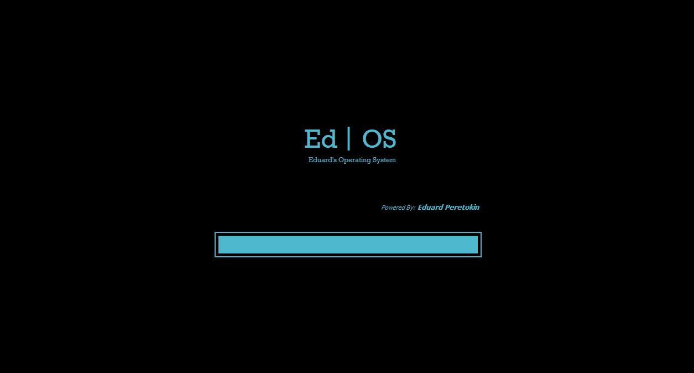
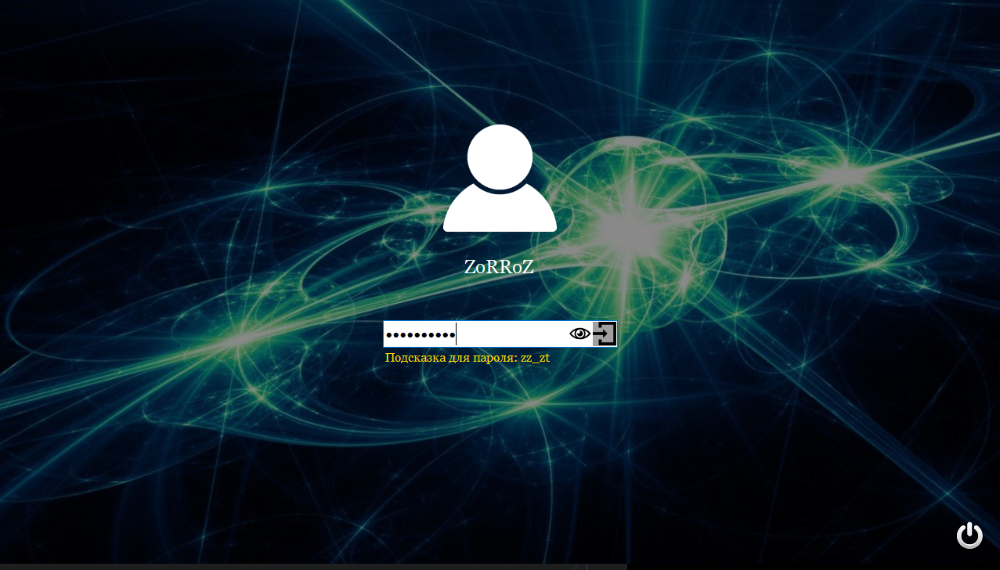
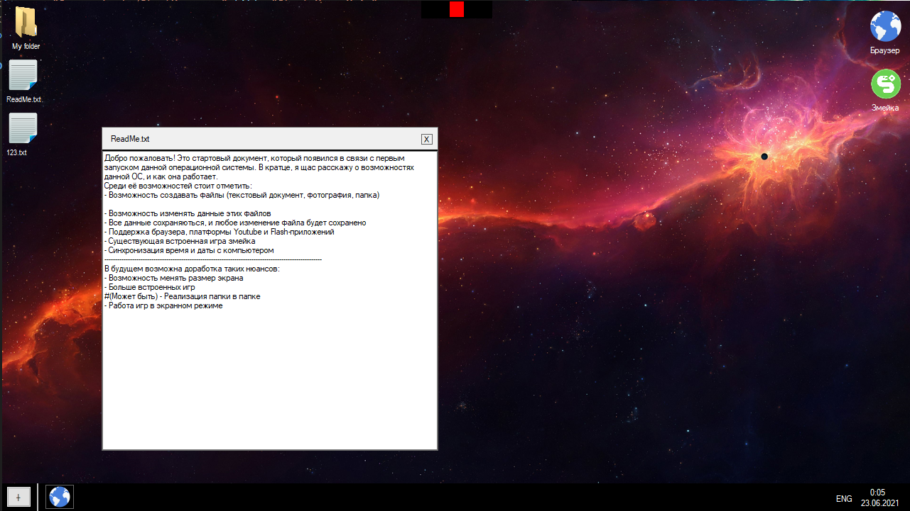
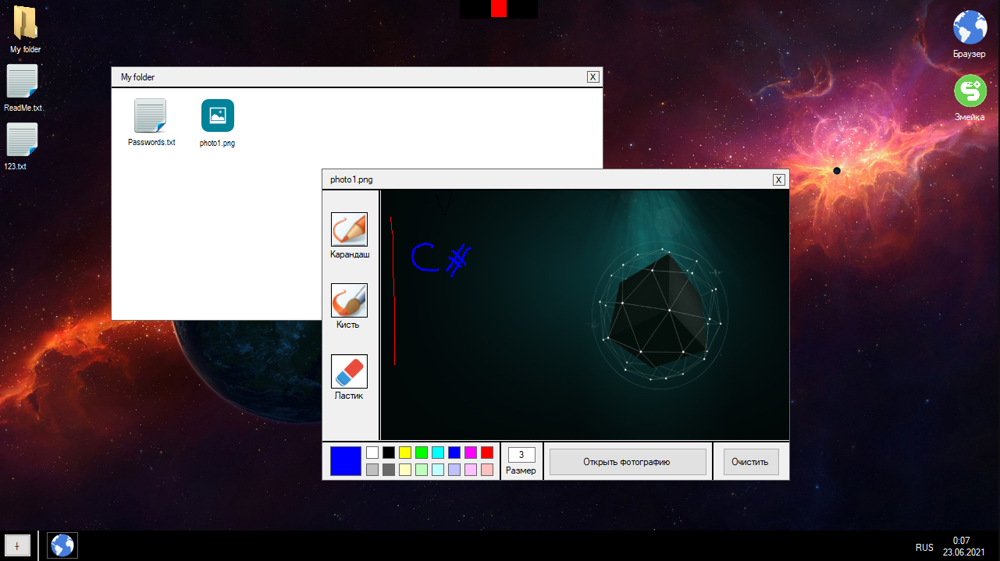
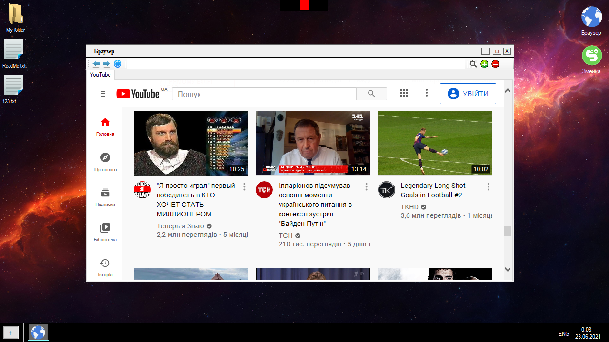

# EdOS(Eduard's Operating System)

It is a Windows Forms Application developed on C# in the style of real windows. It has the *loading animation*, start menu with **Log in** and the worked **Desktop**.

## Usage

- Run the solution

## Information

This is an incredible project made by me. Yes, it has a big problem with code design, but the idea of the program is my favorite.

You can:
- Create a TextFile in **Desktop** or in **Folder**;
- Create a PictureFile in **Desktop** or in **Folder**;
- Create a Folder in **Desktop**;

Also you can:
- Run the program called _Snake_. It is a game **Snake**;
- Run the program called _Browser_ to open the worked browser.
- Change User Settings

## Screenshoots

**Loading Animation**

  
	

**Start Menu**

  
	

**Desktop**

  
	
	

